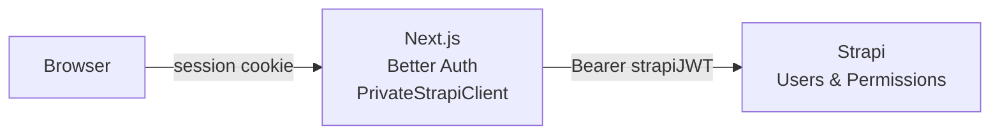
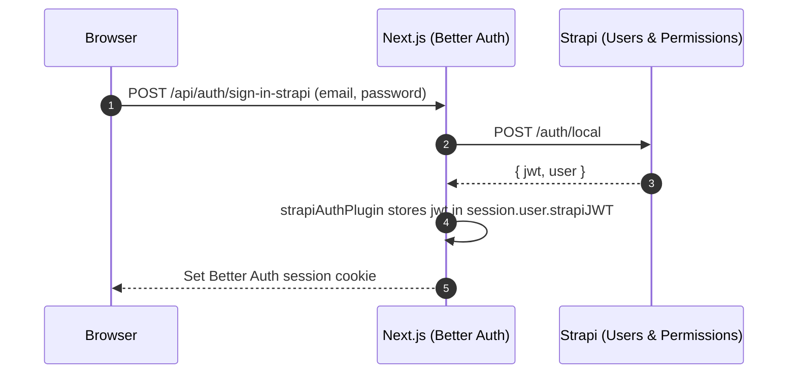

# UI Authentication

End-user authentication for the Next.js app (`apps/ui`). Dual-layer: **Better Auth** owns the session cookie; **Strapi Users-Permissions** issues a JWT used for per-user API calls.

:::info Scope
This page covers authentication of **end-users of your application** (people who visit the site, sign in, register, reset password). For admin-panel SSO (CMS editors logging into Strapi itself), see [Strapi Admin SSO](../strapi-admin/microsoft-sso.md).
:::

## Architecture



### Credential Sign-In Flow

Credential sign-in keeps the browser talking to Next.js while Next.js performs the Strapi login server-side. The UI submits email and password to the custom Better Auth endpoint, Strapi returns a Users & Permissions JWT, and the Better Auth plugin stores that JWT on the session before setting the session cookie.



## Key Files

| File                                         | Purpose                                    |
| -------------------------------------------- | ------------------------------------------ |
| `apps/ui/src/lib/auth.ts`                    | Better Auth server config + Strapi plugins |
| `apps/ui/src/lib/auth-client.ts`             | Better Auth client hooks                   |
| `apps/ui/src/types/better-auth.ts`           | TypeScript interfaces for sessions         |
| `apps/ui/src/lib/strapi-api/request-auth.ts` | Auth header utilities                      |

## Better Auth Plugins

Three custom plugins integrate Better Auth with Strapi:

### strapiAuthPlugin

Handles credential-based authentication:

```typescript
// Endpoints
POST /api/auth/sign-in-strapi          // Login
POST /api/auth/register-strapi         // Registration
POST /api/auth/forgot-password-strapi  // Password reset email
POST /api/auth/reset-password-strapi   // Set new password from reset link
POST /api/auth/update-password-strapi  // Change password (authenticated)
```

### strapiSessionPlugin

Validates Strapi JWT on every session access:

- Calls `/users/me` to verify JWT is still valid
- Checks if user is blocked in Strapi
- Clears session if JWT is invalid/expired

### strapiOAuthPlugin

Syncs OAuth logins with Strapi:

```
POST /api/auth/sync-oauth-strapi   # After OAuth success, create Strapi user
```

## Session Data

The session contains Strapi-specific fields:

```typescript
interface BetterAuthUserWithStrapi {
  id: string
  email: string
  name: string
  strapiJWT: string // Strapi access token
  blocked: boolean // Strapi block status
  provider: string // "credentials" | "github" | "google" | etc.
  emailVerified: boolean
}
```

## Accessing Sessions

### Server-Side (RSC, Server Actions, API Routes)

```typescript
import { headers } from "next/headers"

import { getSessionSSR } from "@/lib/auth"

const session = await getSessionSSR(await headers())

if (session?.user?.strapiJWT) {
  // User is authenticated
}
```

### Client-Side

```typescript
import { authClient } from "@/lib/auth-client"

// Reactive session in a client component or hook.
const { data: session } = authClient.useSession()

// Imperative session lookup.
const { data: session } = await authClient.getSession()

if (session?.user?.strapiJWT) {
  // User is authenticated
}
```

## Using PrivateStrapiClient

The client automatically retrieves JWT from the session:

:::warning Static rendering
Automatic JWT lookup reads the Better Auth session, which is a dynamic operation and prevents static rendering. If a request should not include a user `Authorization` header, pass `omitUserAuthorization: true` in the options object.
:::

```typescript
import { PrivateStrapiClient } from "@/lib/strapi-api"

// Server-side: JWT fetched from cookies
const userData = await PrivateStrapiClient.fetchOne(
  "plugin::users-permissions.user",
  userId
)

// Client-side: use proxy
const userData = await PrivateStrapiClient.fetchOne(
  "plugin::users-permissions.user",
  userId,
  undefined,
  undefined,
  { useProxy: true }
)

// Direct JWT injection (e.g., in API routes)
const userData = await PrivateStrapiClient.fetchOne(
  "plugin::users-permissions.user",
  userId,
  undefined,
  undefined,
  { userJWT: "specific-jwt-token" }
)

// Skip session token detection and omit the Authorization header
const loginResult = await PrivateStrapiClient.fetchAPI(
  "/auth/local",
  undefined,
  {
    body: JSON.stringify({ identifier: email, password }),
    method: "POST",
  },
  { omitUserAuthorization: true }
)
```

## Auth Flow: Session Validation

On every request that accesses the session:

1. `strapiSessionPlugin` intercepts
2. Calls Strapi `/users/me` with stored JWT
3. If valid: refreshes user data from Strapi
4. If invalid/blocked: clears session, user logged out

## Environment Variables

```bash
BETTER_AUTH_SECRET=    # Random secret for session encryption
APP_PUBLIC_URL=        # Base URL for auth callbacks
```

## Related Documentation

- [Strapi API Client](../../ui/strapi-api-client.md) — How the clients handle auth headers
- [OAuth Providers](./oauth-providers.md) — Adding GitHub, Google, etc. login
