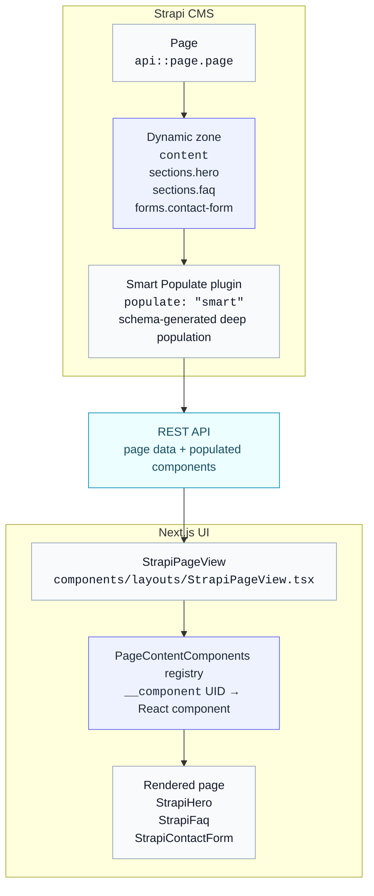

# Introduction

The page builder is the main way to build editable UI pages in this starter.

Instead of hardcoding every marketing page in React, editors compose a page in Strapi by adding reusable components to a dynamic zone and filling in their content. The UI then reads that ordered component list and renders the matching React components.

This gives the project a practical split:

- Strapi owns page structure and content.
- The UI owns visual implementation and behavior.
- Editors can change page composition without code changes, as long as the needed components already exist.

For design-system decisions around CMS fields, variants, shared section configuration, and reusable UI states, see [CMS And Components](/docs/design-system/cms-and-components).



**Data flow:**

1. Editor adds components to page's `content` dynamic zone in Strapi admin
2. Page is fetched via REST API with deep population (handled by [Smart Population](../strapi/plugins/smart-populate.md))
3. `StrapiPageView` iterates over the `content` array
4. Each item's `__component` UID is matched against `PageContentComponents` registry
5. Matching React component renders with full component data as props

## Component Registry

The mapping between Strapi component UIDs and React components is defined in:

**`apps/ui/src/components/page-builder/index.tsx`**

```ts
export const PageContentComponents: {
  [K in UID.Component]?: React.ComponentType<any>
} = {
  // Utilities
  "utilities.ck-editor-content": StrapiCkEditorContent,

  // Sections
  "sections.hero": StrapiHero,
  "sections.faq": StrapiFaq,
  "sections.carousel": StrapiCarousel,
  // ...

  // Forms
  "forms.contact-form": StrapiContactForm,
  "forms.newsletter-form": StrapiNewsletterForm,
  // ...
}
```

Components are grouped by category (matching Strapi's component folder structure).

## Naming Conventions

| Element               | Pattern                                    | Example                                                                  |
| --------------------- | ------------------------------------------ | ------------------------------------------------------------------------ |
| Strapi UID            | `category.kebab-case`                      | `sections.hero`                                                          |
| Strapi schema file    | `{name}.json`                              | `apps/strapi/src/components/sections/hero.json`                          |
| Strapi collectionName | `components_{category}_{name_underscored}` | `components_sections_hero`                                               |
| React component       | `Strapi{PascalCase}`                       | `StrapiHero`                                                             |
| React file            | `Strapi{PascalCase}.tsx`                   | `apps/ui/src/components/page-builder/components/sections/StrapiHero.tsx` |

Keep design, CMS, and code names aligned. The design-system naming guidance lives in [CMS And Components](/docs/design-system/cms-and-components#naming-across-design-code-and-cms).

## Props Typing

React components receive their data via a `component` prop, typed using the `Data.Component` utility from `@repo/strapi-types`:

```typescript
import { Data } from "@repo/strapi-types"

export function StrapiHero({
  component,
}: {
  readonly component: Data.Component<"sections.hero">
}) {
  return (
    <section>
      <h1>{component.title}</h1>
      {component.subTitle && <h2>{component.subTitle}</h2>}
      {/* ... */}
    </section>
  )
}
```

The generic parameter is the Strapi component UID (e.g., `"sections.hero"`). This provides full type safety for all attributes defined in the component schema.

## Population Rules

Dynamic zone content requires explicit population of nested relations and components. Use `"smart"` populate tokens for page-builder fields that should use schema-generated deep population.

:::tip
Configuration and override examples live in [Smart Population](../strapi/plugins/smart-populate.md).
:::

**Key patterns:**

- Use `"smart"` for dynamic zones and components that should use the generated populate shape
- Keep manual populate objects for small flat relations or custom API needs

## Page Rendering

The rendering logic lives in `StrapiPageView`:

**`apps/ui/src/components/layouts/StrapiPageView.tsx`**

```typescript
// Simplified excerpt
export default function StrapiPageView({ page, params, searchParams }: Props) {
  return (
    <main>
      {page.content.map((component) => {
        const Component = PageContentComponents[component.__component]

        if (Component == null) {
          return <div>Component not implemented</div>
        }

        return (
          <ErrorBoundary key={`${component.__component}-${component.id}`}>
            <Component
              component={component}
              page={page}
              pageParams={params}
              searchParams={searchParams}
            />
          </ErrorBoundary>
        )
      })}
    </main>
  )
}
```

The real implementation also handles fetching, locale setup, structured data, and missing pages. The important part is that each dynamic-zone item is resolved through `PageContentComponents` and rendered with its own content data.

## Adding New Components

New page-builder sections should be added through the AI skills workflow so the CMS fields, frontend rendering, reuse checks, tests, and review steps stay connected.

Start with [Agent Skills](../reference/AI/skills/overview.md) for the full workflow. For page-builder work, the main entry points are:

- [find-component](../reference/AI/skills/find-component.md) — check whether an existing section already fits.
- [copy-component](../reference/AI/skills/copy-component.md) — reproduce a section from a screenshot, description, or code snippet.
- [create-content-component](../reference/AI/skills/create-content-component.md) — add a new CMS-driven section when nothing existing matches.

## Related Documentation

- [Pages Hierarchy](./pages-hierarchy.md) — URL structure and slug management
- [Strapi API Client](../ui/strapi-api-client.md) — fetching content from Strapi
