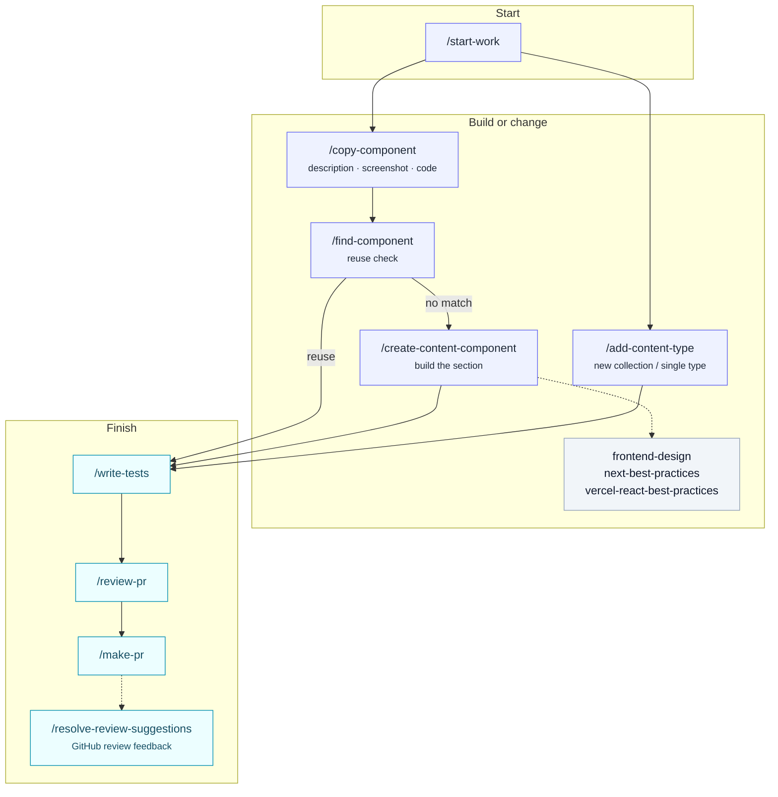
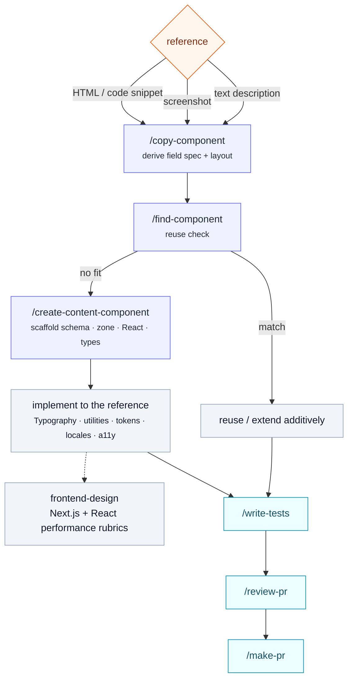
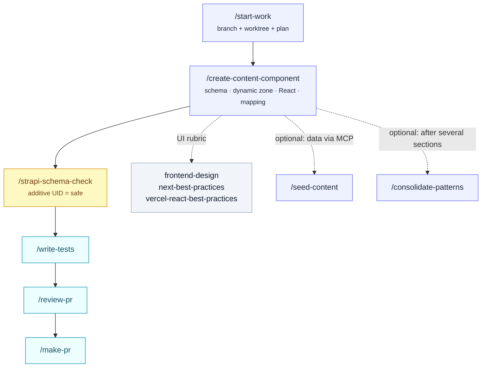
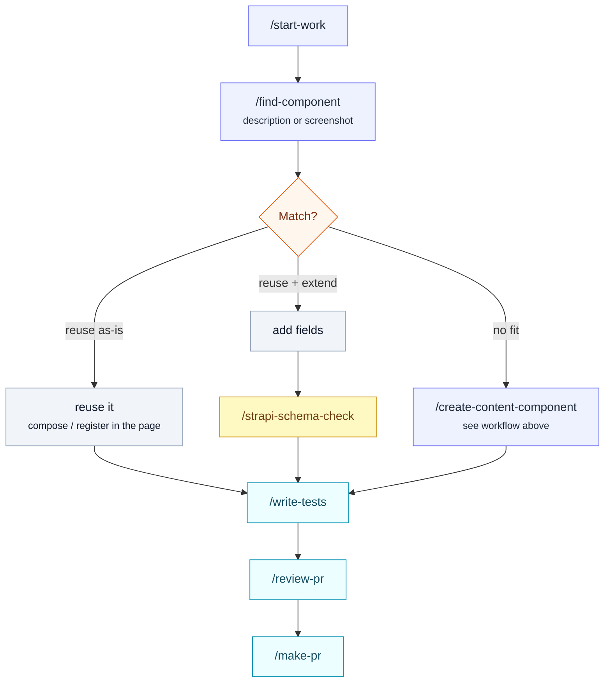
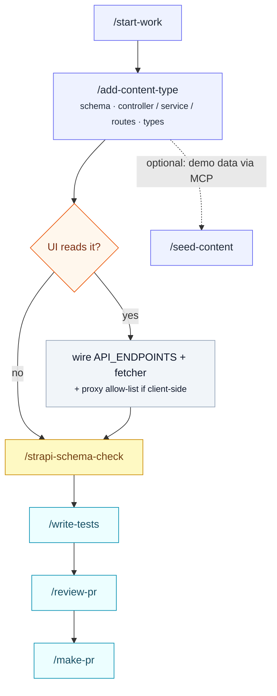

# Agent Skills

Skills are reusable agent instructions for common tasks in this repo. They live in `.claude/skills/` (one folder per skill), auto-discovered by Claude Code; a committed `.agents/skills/` symlink exposes the same set to any agent following the [agentskills.io](https://agentskills.io) standard (Codex, Copilot CLI, Gemini).

An agent loads a skill when your request matches its trigger (e.g. "add a locale", "open a PR", "review this branch"), or when you invoke it directly as a slash command (`/make-pr`).

See the [Workflows](#workflows) section below for diagrams of how these chain together for common tasks. Supporting skills such as `frontend-design`, `next-best-practices`, and `vercel-react-best-practices` usually run as rubrics inside UI, component, and review workflows rather than as standalone task starters.

## Catalog

| Skill                                                           | Type              | What it does                                                                               |
| --------------------------------------------------------------- | ----------------- | ------------------------------------------------------------------------------------------ |
| [add-content-type](./add-content-type.md)                       | Stack-coupled     | Scaffold a Strapi v5 collection or single type + UI wiring.                                |
| [add-locale](./add-locale.md)                                   | Stack-coupled     | Wire a new locale into Strapi i18n + Next.js routing.                                      |
| [add-ui-component](./add-ui-component.md)                       | Stack-coupled     | Add a Next.js / shadcn UI component under `apps/ui` (includes shadcn CLI + fixup).         |
| [create-content-component](./create-content-component.md)       | Stack-coupled     | Build a page-builder section across Strapi + Next.js.                                      |
| [copy-component](./copy-component.md)                           | Stack-coupled     | Replicate a section from a description, screenshot, or code snippet.                       |
| [find-component](./find-component.md)                           | Stack-coupled     | Find an existing page-builder component by description or screenshot.                      |
| [consolidate-patterns](./consolidate-patterns.md)               | Stack-coupled     | Extract repeated JSX into shared elementary components.                                    |
| [seed-content](./seed-content.md)                               | Stack-coupled     | Seed pages / navbar / footer into local Strapi via MCP.                                    |
| [strapi-schema-check](./strapi-schema-check.md)                 | Stack-coupled     | Flag risky Strapi schema changes that need a migration.                                    |
| [remove-sentry](./remove-sentry.md)                             | Stack-coupled     | Remove Sentry from both apps, keep structured logging.                                     |
| [remove-azure-monitor](./remove-azure-monitor.md)               | Stack-coupled     | Remove the Azure Monitor exporter, keep logging + OTel.                                    |
| [remove-cache-revalidation](./remove-cache-revalidation.md)     | Stack-coupled     | Uninstall the cache revalidation feature (and CDN purge).                                  |
| [remove-cdn-purge](./remove-cdn-purge.md)                       | Stack-coupled     | Uninstall only the optional CDN purge layer.                                               |
| [start-work](./start-work.md)                                   | Stack-agnostic    | Start work on an issue in an isolated worktree + plan.                                     |
| [make-pr](./make-pr.md)                                         | Stack-agnostic    | Commit, push, and open a GitHub PR from the branch.                                        |
| [review-pr](./review-pr.md)                                     | Stack-agnostic    | Review a PR or local branch diff before merge.                                             |
| [resolve-review-suggestions](./resolve-review-suggestions.md)   | Stack-agnostic    | Use authenticated `gh` to implement unresolved GitHub PR review threads.                   |
| [validate-branch-refs](./validate-branch-refs.md)               | Stack-agnostic    | Fix stale references/claims a branch's diff left behind.                                   |
| [write-tests](./write-tests.md)                                 | Stack-agnostic    | Add or extend Vitest / Playwright tests.                                                   |
| [find-skills](./find-skills.md)                                 | Helper / vendored | Discover and install additional agent skills.                                              |
| [frontend-design](./frontend-design.md)                         | Helper / vendored | Apply distinctive, subject-specific frontend design direction.                             |
| [next-best-practices](./next-best-practices.md)                 | Helper / vendored | Apply Next.js App Router, RSC, data, metadata, image, font, script, and bundling guidance. |
| [vercel-react-best-practices](./vercel-react-best-practices.md) | Helper / vendored | Apply Vercel React and Next.js performance rules.                                          |

**Stack-coupled** skills know this starter's file layout and conventions. **Stack-agnostic** skills work on any repo and may move to a shared plugin later. **Helper / vendored** skills are installed into this repo and used as supporting rubrics or ecosystem tools.

## Workflows

How the skills chain together for common tasks. Every implementation path ends the same way — **write tests → review → open the PR**. After reviewers comment on GitHub, `resolve-review-suggestions` handles the feedback loop; it is GitHub-only and requires authenticated `gh`.

### At a glance

The entry points and the shared finish.

### Replicating a component (description, screenshot, or code)

`/copy-component` is the front door when you have a **reference** to reproduce. It derives a field spec from any of three inputs, reuse-checks via `/find-component`, delegates scaffolding to `/create-content-component`, then implements to the reference using the starter's conventions.

### Adding a new Strapi component

A page-builder section, built across Strapi and the frontend. The schema check is the safety gate; seeding demo content and extracting shared patterns are optional. Seeding a brand-new component needs a Strapi restart first — components register on boot.

### Finding an existing component (description or screenshot)

Before building, run `/find-component` with a description of what you need — or a screenshot of the UI. It searches the component schemas, renderers, and the showcase, then ranks matches. A fit means reuse (or reuse + extend, which is a schema change); no fit drops into "Adding a new Strapi component".

### Creating a new content type

A standalone collection or single type with its own API. Wire the UI only if the frontend reads it; the schema check still gates the change.

