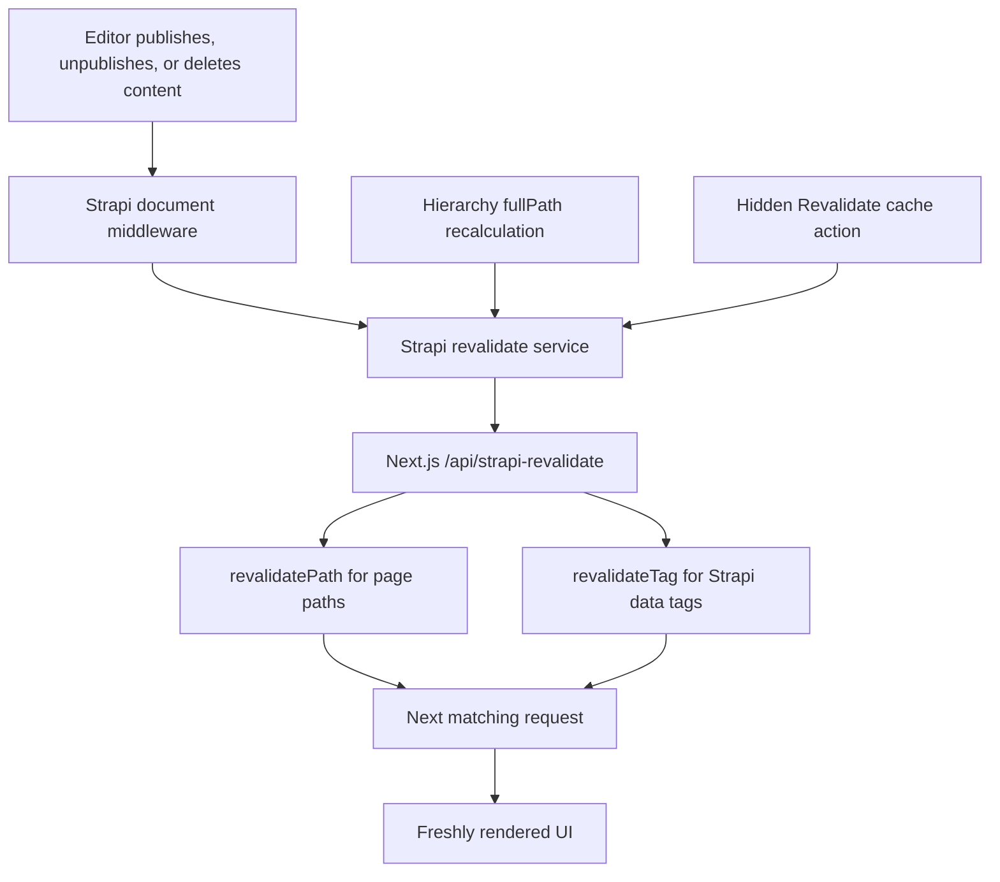

# Cache Revalidation

How Strapi content updates become visible on the Next.js frontend without a rebuild, and where optional CDN cache purging fits.

## How It Works (automatically)

Strapi-driven pages use ISR. The static page route has its own `revalidate` window, and individual Strapi fetches can also define Data Cache windows. Visitors receive cached content immediately, and stale entries regenerate in the background.

On publish/update/delete, a Strapi **Document Service middleware** calls the `api::revalidate.revalidate` service. The service POSTs to the UI route `POST /api/strapi-revalidate`, which marks the matching cache entries stale through:

- `revalidatePath` for page-like paths such as pages and redirects
- `revalidateTag(tag, "max")` for shared content such as navbar and footer

The next request re-renders with fresh Strapi data without waiting for the normal TTL to expire.

:::tip Cache revalidation is not CDN purge
Next.js revalidation marks the application cache stale. It does not automatically evict an upstream CDN. For incident-time CDN cache eviction, use the optional [CDN](./integrations/cdn) flow.
:::

## Flow Diagram



## Revalidate Windows

| Cache layer                    | Interval | Notes                                                                             |
| ------------------------------ | -------- | --------------------------------------------------------------------------------- |
| Static Strapi page route       | 300s     | `apps/ui/src/app/[locale]/[[...rest]]/page.tsx` exports `revalidate = 300`.       |
| `fetchPage`                    | 120s     | Strapi page-data fetch window. Path-revalidated on publish.                       |
| Base Strapi client fetches     | 60s      | Default Data Cache fallback when a fetch does not override `next.revalidate`.     |
| `fetchNavbar`, `fetchFooter`   | 600s     | Shared content tagged with `strapi:<uid>`; TTL is the backstop after tag updates. |
| Development Strapi API fetches | 0s       | `next dev` skips the Data Cache, so cache invalidation is not fully observable.   |

:::info TTL is the backstop
On-demand revalidation handles fresh publishes immediately. The `revalidate` intervals still matter when a webhook fails, a collection is not configured for automatic revalidation, or a cached entry has no matching tag/path.
:::

## What Gets Revalidated

| Content type             | Mode                              | Trigger                  |
| ------------------------ | --------------------------------- | ------------------------ |
| `api::page.page`         | path (`fullPath`)                 | publish/unpublish/delete |
| `api::redirect.redirect` | path (`source`)                   | publish/unpublish/delete |
| `api::navbar.navbar`     | tag (`strapi:api::navbar.navbar`) | create/update/delete     |
| `api::footer.footer`     | tag (`strapi:api::footer.footer`) | create/update/delete     |

:::important Enable automatic revalidation
`REVALIDATE_COLLECTIONS` in `apps/strapi/src/documentMiddlewares/revalidate.ts` is the allowlist for automatic revalidation. Add a content type there before expecting its publish/update/delete events to invalidate the UI cache.
:::

For tag-based invalidation, also tag the matching fetch in `apps/ui/src/lib/strapi-api/content/server.ts`.

Tag revalidation handles cross-page invalidation automatically. For example, every route that renders a fetch tagged with `strapi:api::navbar.navbar` becomes stale when the navbar tag is revalidated.

## Trigger Policy

The document middleware derives its default policy from Strapi Draft & Publish:

- `draftAndPublish: true` → revalidate publish, unpublish, delete, and published-status updates
- `draftAndPublish: false` → revalidate every write because saves are immediately public

:::caution Internal writes are skipped by middleware
The hierarchy recalculation writes documents with `updatedBy: null`. The document middleware skips those writes to avoid duplicate calls; the hierarchy service revalidates the affected paths once per batch instead.
:::

## Bulk Hierarchy Changes

Moving a page recalculates child `fullPath`s through the Hierarchy single type action, which writes with `updatedBy: null`. The document middleware skips those writes to avoid duplicate calls, so the **hierarchy service** (`applyPendingChanges` in `apps/strapi/src/api/hierarchy/services/hierarchy.ts`) revalidates the aggregated touched paths once per batch instead.

Redirect sources are also batched. They are already locale-prefixed, so the revalidation service sends them without a locale override.

## Locale Handling

Strapi stores canonical paths, while the UI serves default-locale and unprefixed variants. Before calling `revalidatePath`, `POST /api/strapi-revalidate` expands paths through `addDefaultLocalePathVariants`.

| Input path | Revalidated variants      |
| ---------- | ------------------------- |
| `/careers` | `/en/careers`, `/careers` |
| `/`        | `/en`, `/`                |
| `/jobs/*`  | `/en/jobs/*`, `/jobs/*`   |
| `/*`       | `/*`                      |

## Manual Revalidation

:::info Fallback action
Editors can force-revalidate a single entry from the **Revalidate cache** button in the page/navbar/footer edit view. The button is hidden by default and appears only with `?showRevalidateCache=true` because automatic revalidation should handle normal publish/update/delete flows. Treat the button as a fallback for debugging or recovery.

If the project needs this action always visible, remove the `showRevalidateCache` query-parameter guard from `apps/strapi/src/admin/extensions/DataRevalidate/DataRevalidateButton.tsx`.
:::

The manual Strapi endpoint requires a valid admin token and accepts either `fullPaths` or `tags`.

## Request Payload

Strapi authenticates the call with an `Authorization: Bearer <STRAPI_REVALIDATE_SECRET>` header (the UI verifies it with a constant-time comparison **before** reading the body). The secret is never part of the payload. The UI endpoint then receives this shape:

```json
{
  "uid": "api::page.page",
  "next": {
    "fullPaths": ["/about"],
    "tags": ["strapi:api::page.page"]
  }
}
```

At least one of `next.fullPaths` or `next.tags` must be provided. The Strapi service builds this payload from the simpler revalidation input (`uid`, `fullPaths`, `locale`, `tags`).

## CDN Optional Flow

Revalidation does not purge an upstream CDN. Operators can use the **CDN cache** widget for urgent cache eviction, such as hot fixes, takedowns, or broken redirects.

See [CDN](./integrations/cdn) for the purge flow, provider setup, and Azure Front Door propagation notes.

## Testing

Use `next dev` to check that endpoints and Strapi middleware fire. Use a production UI build to test the real Data Cache behavior and the full revalidation lifecycle.

```bash
pnpm build:ui
pnpm start:ui
```

Useful checks:

- Call `POST /api/strapi-revalidate` with an `Authorization: Bearer <STRAPI_REVALIDATE_SECRET>` header and confirm the response lists paths/tags.
- Publish a configured Strapi document and confirm Strapi logs a revalidation request.
- Revisit the affected page and confirm fresh content appears after the next request.
- Submit a path through the CDN cache widget only when testing the optional CDN cache purge flow.

:::caution Secret required
`STRAPI_REVALIDATE_SECRET` must match in Strapi and the UI. If it is missing or mismatched, UI revalidation rejects the request with `401`. The CDN purge endpoint uses `STRAPI_CDN_PURGE_SECRET`.
:::

## Configuration

| Variable                       | Where       | Purpose                                      |
| ------------------------------ | ----------- | -------------------------------------------- |
| `STRAPI_REVALIDATE_SECRET`     | Strapi + UI | Bearer secret for Strapi → UI revalidation.  |
| `STRAPI_CDN_PURGE_SECRET`      | Strapi + UI | Bearer secret for Strapi → UI CDN purge.     |
| `CLIENT_URL`                   | Strapi      | Frontend base URL used by Strapi callbacks.  |
| `STRAPI_URL`                   | UI          | Strapi base URL used by the public client.   |
| `STRAPI_REST_READONLY_API_KEY` | UI          | Read-only token for UI-side Strapi requests. |

Optional CDN provider variables are covered in [CDN](./integrations/cdn). See [Strapi environment variables](../strapi/environment-variables) and [UI environment variables](../ui/environment-variables) for the complete environment reference.
