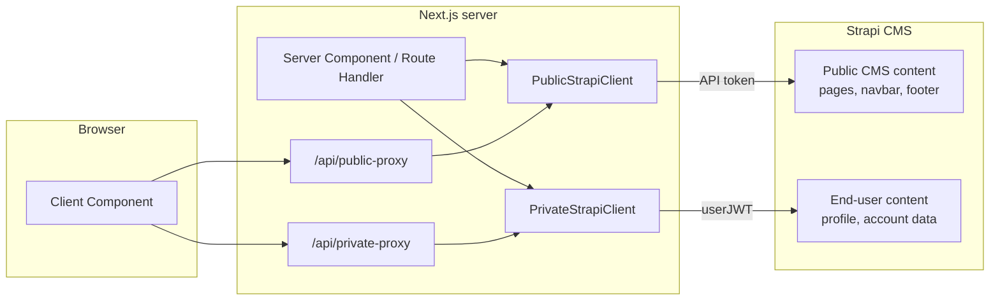

# Strapi API Client

The Strapi API client provides a type-safe interface for fetching content from Strapi CMS. It implements a dual-client pattern with proxy routes for security.

:::tip TLDR
Use `PublicStrapiClient` for fetching public CMS content. Use `PrivateStrapiClient` for fetching user-specific data that depends on end-user authentication.
:::

## Architecture



`PublicStrapiClient` is the default choice for shared CMS content: pages, navigation, footer data, SEO data, and other content that is the same for every visitor. It uses Strapi application API tokens on the server side, so client components should reach it through the public proxy route when browser-side fetching is needed.

`PrivateStrapiClient` is for content that belongs to the signed-in end user. It uses the end user's Strapi JWT from the Better Auth session, or a JWT passed directly in request options, and should be used for protected endpoints where the response depends on the current user.

Automatic user JWT lookup reads the Better Auth session. In Server Components this is a dynamic operation, so it prevents static rendering. When a `PrivateStrapiClient.fetchAPI()` request should not detect the current user or send an `Authorization` header, pass `omitUserAuthorization: true` in the options object.

Both clients share the same base behavior for locale handling, response parsing, endpoint mapping through `API_ENDPOINTS`, and default Strapi fetch caching.

```typescript
import { PrivateStrapiClient, PublicStrapiClient } from "@/lib/strapi-api"
```

:::tip
You do not need proxy routes when all Strapi data is fetched in Server Components or Route Handlers, the browser never sends Strapi write requests, and there is no end-user authorization. In that setup, remove the proxies and keep the architecture simpler.
:::

### Proxy Routes

Client components can use proxy routes when they need to call Strapi through the Next.js server. These routes hide `STRAPI_URL`, keep server-side tokens out of the browser, and enforce an endpoint allowlist.

See [Public Strapi Proxy](./built-in-api-routes/public-proxy.md) and [Private Strapi Proxy](./built-in-api-routes/private-proxy.md) for route behavior and allowlist rules.

### TypeScript Support

The client uses `@repo/strapi-types` so requests and responses are typed from the selected Strapi content type UID. For example, calling `fetchOne("api::page.page", ...)` gives TypeScript the matching page response shape, while query params are typed against the same content type.


The selected content type also drives typed request options, including nested populate configuration such as `populate: { seo }`.


The generated types come from the Strapi schemas and are shared through `packages/strapi-types`. See [`@repo/strapi-types`](../reference/packages/strapi-types.md) for package details.

#### Adding New Endpoints

Add every fetchable content type to `API_ENDPOINTS`:

```typescript
// apps/ui/src/lib/strapi-api/base.ts
export const API_ENDPOINTS: { [key in UID.ContentType]?: string } = {
  "api::page.page": "/pages",
  "api::footer.footer": "/footer",
  "api::your-new-type.your-new-type": "/your-new-types", // add here
}
```

:::warning
Keep `API_ENDPOINTS` in sync with Strapi content types. The client uses this mapping to resolve the REST endpoint for a selected UID, and TypeScript uses the same UID to infer typed request options and response data.
:::

Add the endpoint to the proxy allowlist when it needs to be fetched from browser-side code, usually through a client component using a proxy route:

```typescript
// apps/ui/src/lib/strapi-api/request-auth.ts
const ALLOWED_STRAPI_ENDPOINTS = {
  GET: [
    "api/your-new-types", // add here
  ],
}
```

## Fetch Methods

### fetchOne()

Fetch a single document by ID (collection types) or without ID (single types).

```typescript
// Single type (no ID)
const navbar = await PublicStrapiClient.fetchOne(
  "api::navbar.navbar",
  undefined,
  { locale, populate: { links: true } }
)

// Collection type (with ID)
const page = await PublicStrapiClient.fetchOne("api::page.page", documentId, {
  locale,
  populate: { content: true },
})
```

### fetchMany()

Fetch multiple documents with optional filters and pagination.

```typescript
const pages = await PublicStrapiClient.fetchMany("api::page.page", {
  locale,
  filters: { slug: { $startsWith: "blog" } },
  pagination: { page: 1, pageSize: 10 },
})
```

### fetchAll()

Fetch all documents, automatically handling pagination.

```typescript
const allPages = await PublicStrapiClient.fetchAll("api::page.page", {
  locale,
  fields: ["fullPath", "slug"],
})
```

Internally fetches pages of 100 items and aggregates results.

### fetchOneBySlug()

Fetch a single document by its `slug` field.

```typescript
const page = await PublicStrapiClient.fetchOneBySlug(
  "api::page.page",
  "about-us",
  { locale }
)
```

### fetchOneByFullPath()

Fetch a single document by its `fullPath` field (for hierarchical pages).

This is the most used helper for page builder content fetching because public CMS pages are resolved from the current route path.

```typescript
const page = await PublicStrapiClient.fetchOneByFullPath(
  "api::page.page",
  "/services/web-development",
  {
    locale,
    populate: { seo: true, content: "smart" },
  }
)
```

## Usage Examples

### Server Component

```typescript
// apps/ui/src/lib/strapi-api/content/server.ts
import { PublicStrapiClient } from "@/lib/strapi-api"

export async function fetchPage(fullPath: string, locale: Locale) {
  const dm = await draftMode()

  return await PublicStrapiClient.fetchOneByFullPath(
    "api::page.page",
    fullPath,
    {
      locale,
      status: dm.isEnabled ? "draft" : "published",
      populate: { seo: true, content: "smart" },
    }
  )
}
```

### Client Component with Proxy

```typescript
"use client"

import { PublicStrapiClient } from "@/lib/strapi-api"

async function fetchData() {
  const data = await PublicStrapiClient.fetchMany(
    "api::page.page",
    { locale: "en" },
    undefined,
    { useProxy: true } // required for client-side
  )
  return data
}
```

### Authenticated Request

```typescript
import { PrivateStrapiClient } from "@/lib/strapi-api"

// User JWT is automatically retrieved from Better Auth session
const userData = await PrivateStrapiClient.fetchOne("api::user.user", userId, {
  locale,
})
```

### Omitting User Authorization

Use `omitUserAuthorization: true` when calling a Strapi endpoint through `PrivateStrapiClient` without a user JWT. This skips Better Auth session token detection and avoids adding the `Authorization` header.

```typescript
import { PrivateStrapiClient } from "@/lib/strapi-api"

await PrivateStrapiClient.fetchAPI(
  "/auth/local",
  undefined,
  {
    body: JSON.stringify({ identifier: email, password }),
    method: "POST",
  },
  { omitUserAuthorization: true }
)
```

## Related Documentation

- [Page Builder](../page-builder/introduction.md) — how fetched content is rendered
- [Public Strapi Proxy](./built-in-api-routes/public-proxy.md)
- [Private Strapi Proxy](./built-in-api-routes/private-proxy.md)
